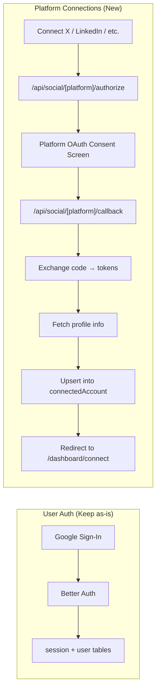

# Social Media OAuth Architecture — Standalone Platform Auth

## Problem Statement

The current architecture **conflates two different concerns** through Better Auth:

1. **User Authentication** (sign in/sign up) — Google OAuth → creates a user session  
2. **Platform Connections** (social posting access) — X, LinkedIn, Instagram, etc. → needs long-lived tokens for posting

Today, when a user clicks "Connect X account", it calls `authClient.linkSocial()` which goes through Better Auth's `socialProviders` / `genericOAuth` system. This stores tokens in the **`account` table** (Better Auth's own table), and then `syncFromOAuth` copies them into the **`connectedAccount` table**.

### Why this is problematic

| Issue | Detail |
|-------|--------|
| **Token ownership confusion** | Better Auth manages the tokens in its `account` table, but we need them in `connectedAccount` for posting. Two sources of truth. |
| **Scope mismatch** | Better Auth's social sign-in requests auth-oriented scopes. Posting requires different/additional scopes (`tweet.write`, `w_member_social`, `pages_manage_posts`, etc.) |
| **Refresh token handling** | Better Auth may not persist refresh tokens correctly for all providers, or may use them for session refresh rather than API access |
| **Multi-account limitation** | `linkSocial` links to the *user identity*, not to a "connected posting account". Adding a second X account is awkward. |
| **No webhook/callback control** | Can't customize the callback to do platform-specific profile fetching, scope validation, or error handling |

---

## Proposed Architecture

> [!IMPORTANT]
> **Better Auth stays for user login only** (Google sign-in). All social media platform connections use standalone OAuth flows that write directly to `connectedAccount`.



### Key Design Decisions

1. **Dedicated API routes per platform** at `/api/social/[platform]/authorize` and `/api/social/[platform]/callback`
2. **Tokens stored directly** in `connectedAccount` table — single source of truth
3. **PKCE flow** for platforms that support it (X/Twitter, LinkedIn)
4. **State parameter** carries the authenticated user's ID + CSRF token
5. **Platform-specific scopes** requested at connection time, not login time
6. **No dependency on Better Auth** for social connections

---

## Current vs. Proposed Flow

### Current (Remove)
```
PlatformCard → authClient.linkSocial("twitter")
  → Better Auth handles OAuth
  → Token lands in `account` table
  → OAuthCallbackHandler calls syncFromOAuth mutation
  → syncFromOAuth reads from `account`, upserts into `connectedAccount`
```

### Proposed (New)
```
PlatformCard → window.location = "/api/social/twitter/authorize"
  → Our route generates PKCE + state, redirects to Twitter OAuth
  → Twitter redirects to "/api/social/twitter/callback"
  → Callback exchanges code for tokens
  → Fetches profile (username, avatar, platform account ID)
  → Upserts directly into `connectedAccount`
  → Redirects to /dashboard/connect?connected=twitter
```

---

## Implementation Plan

### Phase 1: OAuth Infrastructure

#### 1.1 Create the state/PKCE utility

**File:** `src/lib/oauth-utils.ts`

- `generateState(userId: string)` — creates a signed, URL-safe state param (JWT or HMAC) containing `userId` + `nonce`
- `verifyState(state: string)` — validates and returns `userId`
- `generatePKCE()` — generates `code_verifier` + `code_challenge` (S256)
- Short-lived state storage (we'll use an encrypted cookie or the `verification` table)

#### 1.2 Create per-platform OAuth config

**File:** `src/lib/social-oauth/platforms.ts`

Each platform config provides:
```ts
interface PlatformOAuthConfig {
  platformId: string;
  authorizationUrl: string;
  tokenUrl: string;
  userInfoUrl: string;
  scopes: string[];
  clientId: string;
  clientSecret: string;
  usePKCE: boolean;
  parseProfile: (data: any) => {
    accountId: string;
    username: string;
    avatarUrl?: string;
    platformSpecificData?: Record<string, any>;
  };
}
```

Platform configs:

| Platform | Auth URL | Scopes | PKCE | Notes |
|----------|----------|--------|------|-------|
| **X/Twitter** | `https://twitter.com/i/oauth2/authorize` | `tweet.read`, `tweet.write`, `users.read`, `offline.access` | Yes (S256) | Uses OAuth 2.0 with PKCE |
| **LinkedIn** | `https://www.linkedin.com/oauth/v2/authorization` | `openid`, `profile`, `w_member_social` | No | OAuth 2.0, needs `r_liteprofile` for posting |
| **Instagram** | Meta Business OAuth | `instagram_basic`, `instagram_content_publish`, `pages_show_list` | No | Requires Facebook Login → Instagram Graph API |
| **Facebook** | `https://www.facebook.com/v21.0/dialog/oauth` | `pages_manage_posts`, `pages_read_engagement` | No | Page-level posting |
| **YouTube** | Google OAuth 2.0 | `https://www.googleapis.com/auth/youtube.upload` | No | Google OAuth 2.0 |
| **Threads** | Meta Business OAuth | `threads_basic`, `threads_content_publish` | No | Uses Threads API |

### Phase 2: OAuth Route Handlers

#### 2.1 Authorize endpoint

**File:** `src/app/api/social/[platform]/authorize/route.ts`

```
GET /api/social/[platform]/authorize
```

1. Verify user is authenticated (read Better Auth session from cookies)
2. Look up platform config
3. Generate state (with userId embedded) and optionally PKCE
4. Store `code_verifier` in an encrypted httpOnly cookie (for PKCE platforms)
5. Redirect to the platform's authorization URL

#### 2.2 Callback endpoint

**File:** `src/app/api/social/[platform]/callback/route.ts`

```
GET /api/social/[platform]/callback
```

1. Extract `code` and `state` from query params
2. Verify state → get `userId`
3. If PKCE, read `code_verifier` from cookie
4. Exchange `code` for `access_token` + `refresh_token`
5. Call the platform's user-info endpoint to get profile data
6. Upsert into `connectedAccount` table with:
   - `accessToken`, `refreshToken`, `expiresAt`
   - `accountId` (platform-specific user/page ID)
   - `username`, `avatarUrl`
   - `platformSpecificData` (any extra info like page IDs, etc.)
   - `status: "active"`
7. Clear the PKCE cookie
8. Redirect to `/dashboard/connect?connected=[platform]`

### Phase 3: Remove Better Auth Social Providers

#### 3.1 Clean up `config.ts`

- Remove `linkedin`, `twitter` from `socialProviders` (keep `google` for login)
- Remove the `genericOAuth` plugin for Instagram
- Remove `accountLinking` config for social platforms
- Keep only Google in `socialProviders`

#### 3.2 Clean up `connectedAccountRouter`

- Remove `syncFromOAuth` mutation entirely (no longer needed)
- The `getAll`, `getById`, and `delete` mutations stay as-is

#### 3.3 Update frontend

- **`platform-card.tsx`**: Replace `authClient.linkSocial()` with `window.location.href = /api/social/${platform}/authorize`
- **`oauth-callback-handler.tsx`**: Replace the `syncFromOAuth` flow with a simpler `?connected=` param handler that just shows a toast + invalidates the query

### Phase 4: Token Refresh Infrastructure

#### 4.1 Per-platform refresh functions

**File:** `src/lib/social-oauth/refresh.ts`

Each platform has its own refresh logic:
- **X/Twitter**: Already exists in `publishers/twitter.ts` → move to shared location
- **LinkedIn**: Exchange refresh token at `https://www.linkedin.com/oauth/v2/accessToken`
- **Instagram/Facebook**: Long-lived tokens (60-day), exchange for new long-lived token
- **YouTube**: Google refresh token flow

#### 4.2 Inngest token refresh cron

**File:** `src/inngest/functions/refresh-tokens.ts`

A cron job that runs every hour:
1. Query `connectedAccount` where `expiresAt < NOW() + 1 hour` and `status = 'active'`
2. For each, call the platform-specific refresh function
3. Update `accessToken`, `refreshToken`, `expiresAt`, `lastRefreshed` in DB
4. If refresh fails (e.g., user revoked), set `status = 'expired'`

---

## Schema Changes

> [!NOTE]
> The existing `connectedAccount` schema is already well-designed for this. No schema changes needed — it already has `accessToken`, `refreshToken`, `expiresAt`, `platformSpecificData`, and `status`.

The only addition would be an optional `scopes` column to track what scopes were granted:

```ts
// Optional addition to connectedAccount table
scopes: text("scopes"), // comma-separated granted scopes
```

---

## Files to Create / Modify

### New Files
| File | Purpose |
|------|---------|
| `src/lib/social-oauth/platforms.ts` | Platform OAuth configs (URLs, scopes, profile parsers) |
| `src/lib/social-oauth/utils.ts` | State signing, PKCE generation, token exchange helpers |
| `src/lib/social-oauth/refresh.ts` | Per-platform token refresh functions |
| `src/app/api/social/[platform]/authorize/route.ts` | Initiates OAuth flow |
| `src/app/api/social/[platform]/callback/route.ts` | Handles OAuth callback |
| `src/inngest/functions/refresh-tokens.ts` | Cron job for proactive token refresh |

### Modified Files
| File | Change |
|------|--------|
| `src/server/better-auth/config.ts` | Remove social providers (keep Google only) |
| `src/server/api/routers/connectedAccount.ts` | Remove `syncFromOAuth` mutation |
| `src/app/dashboard/connect/_components/platform-card.tsx` | Use direct OAuth URL instead of `authClient.linkSocial` |
| `src/app/dashboard/connect/_components/oauth-callback-handler.tsx` | Simplify to just handle `?connected=` toast |
| `src/app/api/inngest/route.ts` | Register the new `refreshTokens` function |
| `src/inngest/publishers/twitter.ts` | Move `refreshTwitterToken` to shared refresh module |

### Removed
| File/Code | Reason |
|-----------|--------|
| `genericOAuth` plugin in config.ts | Instagram OAuth handled by our own routes now |
| `socialProviders.linkedin` in config.ts | LinkedIn OAuth handled by our own routes now |
| `socialProviders.twitter` in config.ts | Twitter/X OAuth handled by our own routes now |
| `syncFromOAuth` mutation | No longer copying tokens from Better Auth's account table |

---

## Security Considerations

1. **State parameter**: HMAC-signed with `BETTER_AUTH_SECRET` to prevent CSRF and ensure the callback belongs to the right user
2. **PKCE**: Used for all platforms that support it (prevents auth code interception)
3. **Token encryption at rest**: Consider encrypting `accessToken` / `refreshToken` in DB (out of scope for MVP, but recommended)
4. **Callback URL validation**: Each platform's OAuth app must have the exact callback URL whitelisted
5. **Session verification**: The `/authorize` route verifies the user has an active Better Auth session before initiating OAuth

---

## Environment Variables

No new env vars needed — we already have all the client IDs/secrets:
- `X_CLIENT_ID`, `X_CLIENT_SECRET`
- `LINKEDIN_CLIENT_ID`, `LINKEDIN_CLIENT_SECRET`  
- `INSTA_CLIENT_ID`, `INSTA_CLIENT_SECRET`

For new platforms (Facebook, YouTube, Threads), we'd add:
- `FACEBOOK_CLIENT_ID`, `FACEBOOK_CLIENT_SECRET`
- `YOUTUBE_CLIENT_ID`, `YOUTUBE_CLIENT_SECRET`
- `THREADS_CLIENT_ID`, `THREADS_CLIENT_SECRET`
